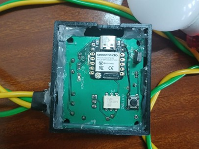
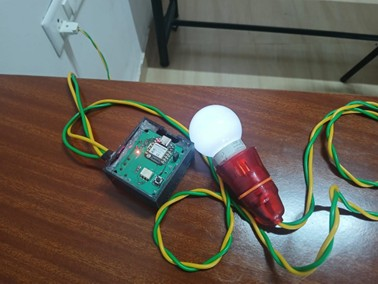
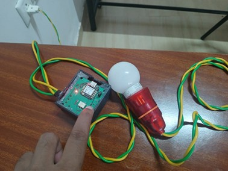

# SafeSwitch

Industrial-grade AC load controller using ESP32-S3 and opto-isolated TRIAC drivers.

## Features

- BLE command “ON”/“OFF” to switch AC loads via MOC3021M + BTA136 TRIAC.
- Manual push-button override.
- LED indication of relay state.
- Safe isolated control: HLK-5M05 power module + opto-isolator.

## Hardware

- **MCU**: Seeed XIAO ESP32-S3
- **Driver**: MOC3021M (opto-isolator) + BTA136 TRIAC
- **Power**: HLK-5M05 AC-DC
- **Input**: Push-button on GPIO1
- **Output**: TRIAC gate on GPIO2

See `hardware/schematic.png` and `hardware/pcb_layout.png`.

## Build & Flash

git clone https://github.com/raviteja091/safeswitch.git/
cd safeswitch/src
idf.py set-target esp32s3
idf.py menuconfig # adjust pins if needed
idf.py build flash monitor

## Usage

- BLE name: **ESP32_SafeSwitch**  
- Write “ON” or “OFF” to characteristic `abcd1234-5678-90ab-cdef-1234567890ab` under service `12345678-1234-1234-1234-1234567890ab`.
- Press push-button to toggle locally.

## Working Images

## License

MIT © 2025 raviteja

